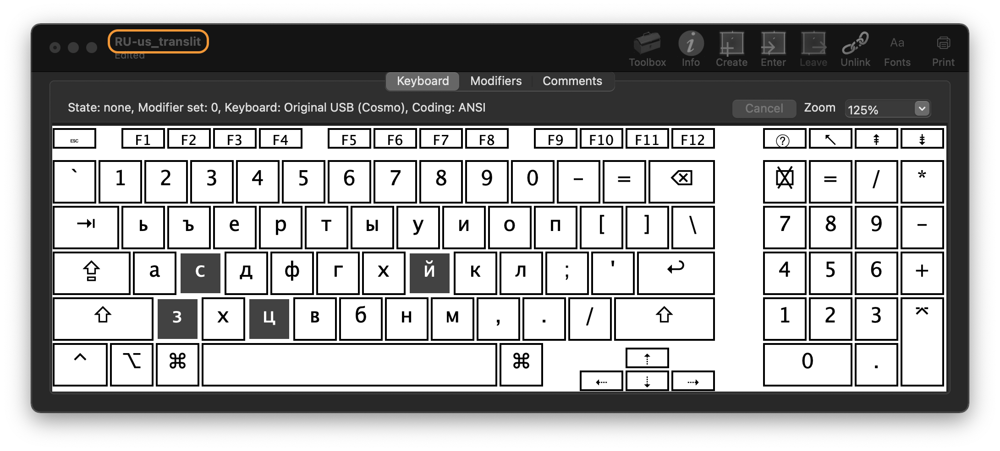
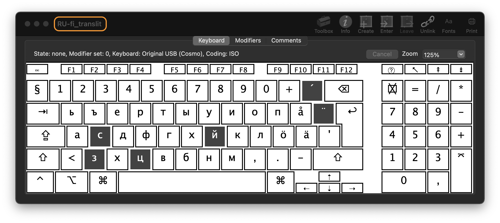
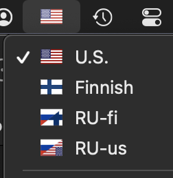

# Custom Cyrillic keyboard layouts for macOS

This repository contains customized Cyrillic/ Russian [transliteration](https://en.wikipedia.org/wiki/Transliteration) keyboard layouts for ISO and ANSI physical keyboards, for use on macOS.

It started from the fact that I didn't know how to touch-type in Russian and ocasionally used Nordic (ISO) and US (ANSI) physical keyboards.

## Features

- Both layouts mostly follow "ГОСТ 16876-71" as implemented on e.g. [Translit](http://www.translit.ru/) web-site.

- Layouts were modified to allow entering Cyrillic/ Russian symbols on both standard ANSI and Nordic (Finnish/ Swedish) ISO keyboards.
  - "ch" -> "ч"
  - "zh" -> "ж"
  - "sh" -> "ш"
  - "shh" -> "щ"
  - "j" -> "й"
  - "je" -> "э"
  - "jo" -> "ё"
  - "ju" -> "ю"
  - "jа" -> "я"

- Keymap

  - ANSI
    
  - Nordic ISO
    

- Each layout has a corresponding icon with double flags.

  

- Standard macOS shortcuts (like `⌘-c`) work correctly

- Tested on macOS Big Sur and Ventura

## Installation

1. [Clone](https://docs.github.com/en/repositories/creating-and-managing-repositories/cloning-a-repository) this repository.

2. Copy the `.bundle` or `./source/*.keylayout` file(s) to the `~/Library/Keyboard Layouts/` folder and restart your mac.

    E.g. from the repo folder run the command in Terminal:

    `cp -R "./ru_us-and-ru_fi_translit_AK.bundle" ~/Library/Keyboard\ Layouts/`

3. Add the new keyboard layout(s) via _System Preferences_. If not listed under _Russian_ language, try _Others_ section.

## Related

- [YouType](https://github.com/freefelt/YouType): display the current keyboard layout in the status bar _as flags_ in macOS.

## Credits

Created using [Ukelele](http://scripts.sil.org/ukelele).
